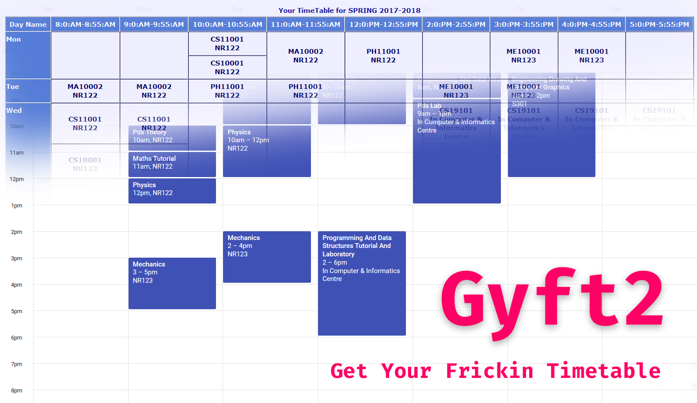

Get Your Freaking Timetable **Reborn**


## About

Processes your timetable from ERP and gives you an **ICS file** which you can add in any common calendar application (such as Google Calendar).

> **Note:** Please use this utility with `python3`. You should have python installed, Also run this to install the dependencies

```sh
$ pip3 install bs4 icalendar #linux/mac
$ pip install bs4 icalendar #windows
```


## How to use the program?

- **Step 1:** Get your timetable from ERP:

Log in to ERP portal, and visit [https://erp.iitkgp.ac.in/Acad/student/view_stud_time_table.jsp](https://erp.iitkgp.ac.in/Acad/student/view_stud_time_table.jsp).

Save this page in the Directory using `Ctrl+S` on any browser (Use `Web page, HTML only`) and make sure to  select the folder of gyft2 for saving the file


- **Step 2:** Now run the gyft script

for Linux/Mac:

  ```sh
  $ python3 gyft2.py
  ```

for Windows:

  ```sh
  > python gyft2.py
  ```


If you chose to generate ICS file, you will have `timetable.ics` in the same directory.
You can follow the guide given below ([taken from here](https://goo.gl/WvdUsP)) to add it to your Google Calendar:

1.  Open Google Calendar on a computer. Note: You can only import from a computer, not a phone or tablet.

2. In the top right, click Settings Settings > Settings.

3. Open the Calendars tab.

4. Click Import calendar between the "My calendars" and "Other Calendars" sections.

5. Click Choose File and select the file you exported. The file should end in "ics" or "csv"

6. Choose which calendar to add the imported events to. By default, events will be imported into your primary calendar.

7. Click Import.

If you for some reason chose No:
- Your timetable will be saved in `data.txt`. Make any changes required appropriately in `data.txt`.

> Please star the project if you found it useful

## Bonus Step:

To generate an ICS file from `data.txt`:
- **Step (i):** Run the command:

    ```sh
    $ python3 generate_ics.py
    # or for windows
    > python generate_ics.py
    ```

    ```sh
    # you can provide input and output file path to this python script
    $ python3 generate_ics.py --input d.txt --output t.ics
    # or for windows
    > python3 generate_ics.py --input d.txt --output t.ics
    ```


- **Step (ii):** Open your calendar application and import this ICS file
    into it. For Google Calendar You can follow [this guide](https://support.google.com/calendar/answer/37118?hl=en).


## License

GPLv3.
